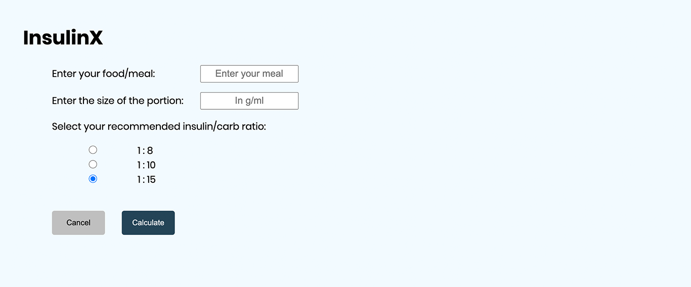
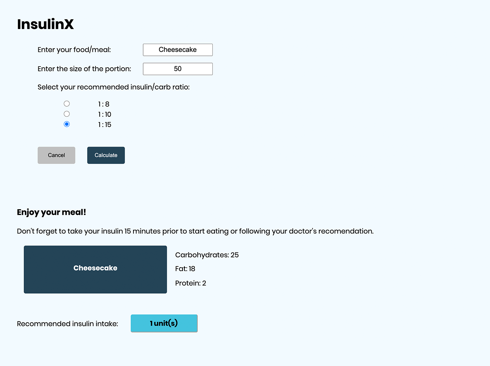

# InsulinX: App for patients with diabetes

**Problem**
- The problem that many patients with Diabetes faces today is to find the right balance of carb intake and insulin to compensate for the amount of carb that is being consumed so we aim to do the calculations for the patient taking the user input and crossing with the nutrition values in the dataset

**Target**
- Predict the total carbohydrates of a meal according to its nutricional value to help patients with diabetes adjust the right amout of insulin needed.

**Audience**
- Medical Staff (Nurses, Doctors, ...)
- Type 1 Diabetes Patients

**Usage**
- Patients and Doctors can track the data that will be produced in the app and keep the historical record of past meals and the amout of insulin taken for each meal, and how the blood glucose behaved following the app recommendation, based on that a machine learning model can be feed with actual insulin vs carb relation based on the app usage by Diabetics patients.

**Technologies**
- Python
- Flask
- HTML
- CSS
- Dataiku (Database storage)
- APIs

**Project developed for the Doctolib + Dataiku Hackathon (24 - 26 June 2020)**
At: Wild Code School, Lisbon

Created by:

  - [Margarida Jervis](https://www.linkedin.com/in/margarida-jervis/)
  - [Mariana Moreira](https://www.linkedin.com/in/marianacormoreira/)
  - [Renato Neto](https://www.linkedin.com/in/rmunhozneto/)
  - [Rita Goncalves](https://www.linkedin.com/in/ritavigoncalves/)

#python #api #ehealth #diabetes #nutrition #programming #flask #html #css
